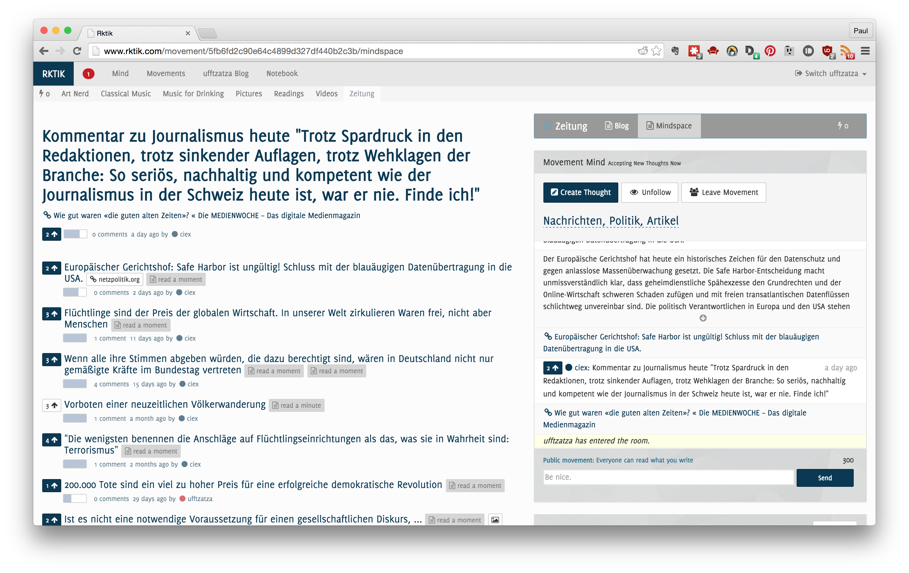

# Conceptual

## Overview

Rktik is an online community where users share text, links and other media pseudonymously in the context of topic-oriented groups and personal blogs. Contents are sorted based both on recency as well as a voting and subscription system.

This chapter will explain the user-facing functionality of the Rktik website on a conceptual level. First, general concepts are explained, introducing readers to the mechanics of using Rktik. Subsequent sections give detailed information on how Rktik handles *content*, *identity* and *context*. 

### Terminology

This section gives a brief overview of terminology used in Rktik. Please see the relevant subsequent sections for more in-depth descriptions.

**Users** are individual persons using the site. They may register by creating a *user account* and one or more associated *personas*. Hereby they are able to create content on the site.

(see [User Accounts])

All actions of users are attributed to their **active persona**, which is a screen name that identifies them across the site. A user may create any number of personas to shape their privacy, but only one of them can be *active* at a time. 

**Thoughts** are short pieces of text submitted by personas and represent the smallest unit of content.

(see [Overview: Thoughts])

Thoughts can link to any number of **percepts**, which are attachments containing either more text or a hyperlink to an external resource. They are displayed alongside the thought throughout the user interface.

(see [Attaching Media: Percepts])

**Mindsets** are collections of thoughts. Any thought that is not a reply to another thought must be contained in a mindset. Every persona has a private and a public mindset (**notebook** and **blog** respectively).

(see [Overview: Mindsets])

**Movements** are groups related to a specific topic. Each of them has a private mindset for members and a public mindset (blog). 

Any persona can create new movements and follow the (public) blog of any movement or other persona.

(see [Movements])

![Class diagram of important classes and relations in Rktik as described in [Terminology]. Most attributes and operations have been omitted for simplicity.](img/terminology.png)

### Frontpage

The Frontpage is located at the root of Rktik and presents users with a stream of thoughts from their movements and followed blogs. It is similar to the Facebook News Feed and the Reddit Frontpage in that the stream is sorted based both on the recency of a submission and the number of votes it has received (see [Distributing Attention: Voting and Hotness]).  

Anonymous users do not have any subscriptions, they are shown thoughts from *top movements*. These are the seven movements with the highest member count.

On the right-hand side of the thought stream, the frontpage also contains a number of other elements:

* The **Frontpage Graph Visualization** displays a visual representation of Frontpage contents as a graph (see [Frontpage Graph Visualization]).
* **Top Thought** When a user is logged in, this contains a short list of thoughts from *top movements* they are not following with their active persona. This allows users to notice particularly popular submissions from contexts they wouldn’t see otherwise.
* **Discover Movements** A listing of those top movements the active persona is not following.
* **Recent Thoughts** The most recent publicly visible thoughts submitted throughout the whole site.

#### Frontpage Graph Visualization

![Frontpage Graph Visualization]

The Frontpage contains a visual representation of its contents in the form of a graph with a force-directed layout. This layout communicates the flow of information from a persona’s subscriptions to their frontpage, while also communicating that not all their content is shown.

The graph represents the Frontpage as a big red node in the center, identities subscribed to by the active persona (content sources) as medium-sized colored nodes and thoughts as small white nodes. 

Thoughts are connected to the center node with a dotted edge if they are currently part of the frontpage stream. Thoughts are also always connected to their author’s identity with a further dotted edge. If none of a content source’s thoughts are contained in the frontpage, it is connected to the center node with a faint dashed edge. Nodes representing thoughts have a pulsating animation with a frequency correlated to their hotness and capped at 5 Hz.

Thereby, the Frontpage contents surround the center node as a ring of white nodes, pulsating faster or slower according to their position in the stream. They are connected to a second ring of nodes which consists of those movements and personas who submitted the thoughts. Other content sources are located a bit further away to show that their submissions are also eligible for inclusion in the Frontpage.

### Notifications

Notifications try and catch the user’s attention in order to present information which is personally relevant. They are displayed in a drop down menu in the top left corner of every page and some of them are also sent as email notifications  [^optout].

[^optout]: A user may opt out of receiving emails about notifications of a specific type. See [User Accounts]. 

 

There are four notification types:

* **Reply**: Sent when another user replies to one of the user’s thoughts
* **Mention**: Sent when someone uses the *@<username>* syntax in a thought to notify a persona directly.
* **Dialogue**: Sent when a new thought is added in a private conversation with another persona
* **Follower**: Sent when a persona’s Blog gains new followers

See [Notification] for implementation details.

## Content

### Overview: Thoughts

*Thoughts* are the basic building block for content in Rktik and rougly equivalent to a post on Facebook or submission on Reddit. They consist of a short text, limited to 300 characters, and any number of percepts (attachments). Thoughts are displayed as part of mindsets in different listing styles, 2) on individual thought pages or 3) as part of a chat conversation (see [Overview: Mindsets]). 

The restriction on title length has been set for two reasons:

1. A short title reduces the flexibility required from page layouts. Longer titles lead to a bigger variation in title length which would make the usage of separate display styles for long and short titles neccessary and in turn increase development and maintenance time.
2. Short titles require users to be concise when formulating thoughts. In turn, they make it easier for other users to read and understand titles.

Thoughts can be created using the dedicated *create thought* page, which is linked from all mindsets in which the active persona has editing rights, or using the *inline thought creator*, which is embedded in comments sections and as part of the chat widget. The latter only allows posting text content up to the length of a thought’s title, but lets users switch to the *create thought* page without losing their input if they wish to continue typing. The dedicated *create thought* page provides separate input fields for title and longform text attachments.

### Reposts

Thoughts can be *reposted*, which creates a copy of the original thought, but links it to a different mindset and attributes it to the persona who created the repost. Reposts are always created as comments on their original, thereby notifying the original author. Visiting a repost’s page, users see the original thought from which it was created displayed in the context area.

### Attaching Media: Percepts

Thoughts may have any number of attachments for enriching their content. These are either rendered as part of the Rktik website or presented as links to other websites.

Currently the following attachment kinds are supported:

* **Links** Can be attached by embedding a URL inside the thought title or longform text.

	Links to pictures may be rendered inline with the thought. Clicking the picture displays it enlarged in a modal gallery view. If multiple links to pictures are linked to a single thought, the modal view allows browsing through the picture gallery using keyboard and onscreen controls. The display size of pictures is also adapted to the size and number of image attachments (see [HTML Templates]).

	Links that point to the *soundcloud.com* and *youtube.com* domain will be rendered using the respective embeddable widgets to allow playing music and videos without leaving the Rktik website.

* **Longform text** As thought titles are limited to 300 characters, the longform text attachment allows adding a longer text. This text may be formatted using the Markdown language ([@Gruber2004]), which provides simple markup for basic text formatting such as headlines, enumerations, bold and italic text.

### Distributing Attention: Voting and Hotness {#hotness}

Personas may vote on thoughts, thereby expressing approval of their content. The number of votes is displayed next to every thought.

Apart from being a visible signal about the number of people who have expressed approval of a thought, votes are also used for sorting thoughts. Depending on context, the order of thoughts is either chronological (chat), reverse chronological (blog) or by their *hotness* value. 

Hotness is a numeric value which depends on the age of a thought and the number of votes it has received. It is higher for thoughts more recent and more voted on. Thoughts with equal numbers of votes are effectively sorted in chronological order, while each additional vote pushes the thought upward in the ordering.

Given the number of upvotes v and the number of hours since the thought was created t, a thought’s hotness is:

	hot = v / pow(t + 2, 1.5)

This algorithm is adapted from the sorting algorithm used in the social bookmarking site [Hacker News](https://news.ycombinator.com/) (see [@Salihefendic2010]).

## Identity

Some popular social media sites including Google+ and Facebook have tried to push users into publishing content on their services using a real name (CITE). This was supposed to curb the effect of the online disinhibition effect (CITE) and increase perceived trustworthiness of these platforms (CITE). The practice proved to be controversial, as it did not align with established Internet culture and prevented people from decoupling their online and offline activities (CITE). 

However, even though a pseudonymous naming system prevents directly linking offline and online identity based on metadata, such a link can be established by other means. Content posted online may be uniquely bound to an offline identity or link to other services that establish such a binding.

Rktik introduces new tools that allow users to shape their digital privacy. Every user may create multiple online identities and use them to separate areas of their online activity. Users may also join their identities by publishing under the name of a movement. In the following I will explain these concepts in detail.

### User Accounts

Any user of Rktik can register a personal user account which allows them to create content and vote on submissions. Creating an account requires a valid email address, a password and a name and color value for the user’s first persona ^[The color value is used to decorate a persona’s username in the site’s design.].

The account feature serves two main purposes:

1. Authorizing a user’s identity when they start a session of using the site, by asking them to enter the account-specific password and email-address combination. Authorized users may act on the site as one of the personas connected to the user account.
2. Obtaining a valid email address, so that users may be sent notifications and other messages related to their activity on the site.

User accounts also store the user’s email preferences allowing users to disable emails of specific kind (see [Notifications]). In general, emails should be sent as little as possible as users may perceive them as spam if they carry insufficent personal relevance or value. 

### Personas

The personal identity of a user of the Rktik website is partially decoupled from their physical identity: While users may choose to use their real name, they can also use one or more pseudonyms.

Other online communities allow this to different extents: On Reddit, a user may choose an arbitrary name for their user profile, while Facebook asks their users to provide their real name for online communication. Rktik goes one step further by not only allowing arbitrary handle names but also featuring arbitrary *numbers* of handles, which are called *personas*. 

On initial signup, new users create their first persona by giving it a name and assigning a color to mark this persona’s submissions. Following completed signup, users can create more personas using the *switch* menu in the upper right corner of every screen. They can also to choose to create a new persona any time they are joining a movement. Therefore, they can keep their membership in that movement separate from activities in other parts of the site.

Other users can not tell whether any two personas are linked to the same user account. 

### Personal vs. Group Identity

Groups on other websites have an identity communicated by the contents of the group and other markers related to the group’s representation on the website (group name, picture, color scheme). Rktik furthers this concept by communicating not just identity but also a movement’s *agency* in 1) language as well as 2) features that suggest group agency.

A movement’s space for internal discussion and exchange is called *mindspace*, implying that the movement has a shared mind, the contents of which are displayed in this place. This notion is also reflected in how users place contents in a group: They *create thoughts* in the *mindspace*.

A movement’s agency is further implied in the functionality of the movement blog. Its contents are not dictated by a designated member of the movement, but selected by personas voting on thoughts in the movement. The movement members collectively put into action decisions, which are then attributed to the movement as a whole, when they are displayed on the site. Please see section [Movement Agency] for possibilities for further development of the concept of movement agency.

—

On the one hand, users have the option of not just operating under one identity but assuming any number of Personas while using the site. These Personas may reflect different social roles, they can be used to voice unpopular opinions or generally content a user doesn’t want to identify with their real name. 

On the other hand, movements, which reflect groups of users, share many features with individual users. They have a blog which allows them to publish contents in the name of the movement and have a place for internal dialogue, similar to how an individual user can use their notebook to remember content.

### Movements

Movements allow groups of users with a shared interest to exchange their thoughts about it. Any user may create new movements by specifying a name and optional mission statement. A movement may also be created with the *private* option, which will hide contents of the movement mindspace from non-members and only allow users with an invitation code to join the movement as a member. Invitation codes may be created by any movement member.

Each movement has its own blog and mindspace with embedded chat room. Members can post thoughts to the movement mindspace by using the *Create Thought* interface or posting to the movement chat. Mindspace contents are sorted by their hotness value (see [Distributing Attention: Voting and Hotness]). 

#### Promoting Content

Alongside each thought in the mindspace a progress bar is displayed which indicates how many more votes are required for a thought in the mindspace to be promoted to the Movement blog. This threshold value depends on the number of members of the group. Given the number of members c it is defined as:

	threshold = round(c / 100 + 0.8 / c + log(c, 1.65)) if c > 0 else 1

[TODO: picture showing relation threshold and number users]

This formula ensures that a low number of votes is required while a movement is small, creating lots of content on the blog,  while a large movement requires more votes relative to its user count so that only the best content will be posted to the blog.

Movements are similar to Facebook Groups, Reddit’s Subreddit feature and Email newsgroups. All of them distinguish between private and public groups as Rktik does, however they don’t provide group members with the ability of democratically deciding on content to be published separately from the group pool to a public medium.

#### Private Movements

When creating a new movement, a user may chose to make it *private*, which 1) hides the movement mindspace from non-members and 2) only allows users with a valid invitation code to enter the movement.

Invitation codes can be sent by movement members by either entering the email addresses of invitees or by copying a URL with embedded invitation code and sending this to the invitee (e.g. using a messenger application).

The blog page of private movements indicates the movement founder so that users interested in joining may contact this founder and ask for an invitation.

## Context

Every thought is linked to the context in which it was created. This can be another thought when a user is submitting a reply, it can be the mindset in which they create the thought or it can be both of them [^both_contexts]. Mindsets are collections of thoughts, owned by identities. There are three different kinds of mindsets for 1) internal thoughts of an identity (mindspace), 2) its published thoughts (blog), and 3) private conversation (dialogue). Each of them is rendered with a particular layout and functionality.

This section will show how communication happens in the context of a single thought, as well as in mindsets. Then, the differences between the three kinds of mindsets are explained though their requirements, tasks and conceptual design.

[^both_contexts]: If a thought is defined as a reply to another thought and also defines a mindset as context it is included in both contexts. Its rendering in each of the contexts also refers to the other side, effectively linking discussion in two separate areas of the website.

### Threaded Discussion

Every thought in Rktik has its own page, which collects all information related to the thought. This includes both its text content and percepts as well as the thought’s context, metadata and reactions to it. Reactions may be replies written by other users, reposts and automatic promotions (see [Promoting Content]). 

Displaying reactions to a thought in a flat listing can make it harder for readers to follow the exchange, as conversations regarding different aspects of the original thought may be interweaved in the listing. Rktik solves this problem by using a hierarchical display of reactions. Direct replies are aligned to the left-hand side of the screen with subsequent replies indented to the right. Every subtree of the discussion is sorted by hotness.

The reaction tree depth is limited to three levels for performance reasons. If a reaction is located in a mindset different from that of the original thought, reactions happening in the other context are also included up to a total depth of three levels.

If the original thought was created as a reply itself, the page also contains its parent thoughts. The thought’s author may define from 0-10 levels, how deep the reply-chain is recursed upwards for this purpose by setting the context-depth setting on the left side of a thought’s page. Setting it to zero hides the thought’s context from other users and removes it from the discussion pages of these ancestors.

### Contextual Rights Management

Depending on context, a different set of identities is authorized to create, edit and delete thoughts in a given mindset. See [Rights Management] for detailed information about which users are authorized for which actions.

### Mindspaces

Mindspaces are the first of three kinds of mindsets. They collect internal thoughts of an identity, as opposed to thoughts published to all users of Rktik. Both personas as well as movements are identities in Rktik and therefore have their own mindspace.

**Persona Mindspace**

Every persona has access to their private mindspace in which only they can read and write. This makes it a space for collecting thoughts before deciding on whether or not to to publish them, or in which context to publish them. The mindspace of a persona is also refered to as the persona’s *notebook* to make it easier for new users to understand how they can use this feature. 

Apart from creating thoughts directly in this mindset, users may also use the *repost* interface (see [Reposts]) to copy thoughts from anywhere on the site into their notebook.

**Movement Mindspace**

The movement mindspace is the primary interface for movement members. This space is facilitating discussion and exchange between movement members and serving as a staging area for content that might be posted to the movement’s blog. The movement mindspace should therefore 1) provide an overview of the most interesting content recently posted to the mindspace and 2) provide members with the sense that they can communicate directly and immediately with each other. To fulfill both of these requirements, the layout displays thoughts both as a listing sorted by hotness as well as using a chat widget. 

While the chat is an automatically updating view of the most recent thoughts, the listing changes slower. As the hot ranking sorts based on recency and number of votes, it is akin to a rolling toplist of the currently most interesting thoughts. These thoughts can collect more votes in the listing view until they reach the threshold for pomotion to the movement’s blog (see [Promoting Content]). A short blue bar displayed underneath each listing entry indicates how many further votes are required for a promotion.

#### Chat

The chat should provide members with a sense of direct and immediate participation in the movement. It provides an automatically updating, chronological listing of all events related to the movement, including all thoughts submitted to the movement mindspace and thumbnails of media attachments.

This allows for a different mode of communication from the listing view and threaded discussion. The immediate transmission of messages allows the use of language with a conversational tone and creates the sense of a more direct exchange between participants. 

Replies to any thought in the movement mindspace are also displayed in the chat, with an annotation that explicitly marks them as replies and provides a hyperlink to their context. This allows movement members watching the chat to directly start participating in those discussions.

Below the chat message listing, an inline form UI allows users to send thoughts to the mindspace/chat. Submitting the form clears the input without reloading the page, so that the user can enter another message immediately. Above the input, a notification text informs the user about the privacy of messages entered, which is dependent on whether the corresponding movement is private or not (see [Private Movements]).

### Blogs

Blogs are mindsets which allow identities to share their thoughts with a wider audience and are sorted in reverse chronological order. Any persona can follow any blog. Doing so places the blog’s contents in the pool of thoughts eligible for that user’s personal frontpage.

Personas can directly post new thoughts to their personal blog, while movement members can only indirectly place content in a movement’s blog through voting (see [Promoting Content]).

### Dialogue

While mindspaces allow exchange between many users, and blogs allow broadcasting to many users, the dialogue mindset models a conversation between just two participants. As it is also implemented as a mindset, messages can be reposted freely between a dialogue and any other context. 

Apart from the different privacy setting, a dialogue provides the same affordances as the chat module in a movement mindspace (see [Chat]).

[Frontpage Graph Visualization]: img/graph.png