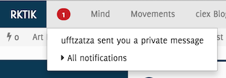
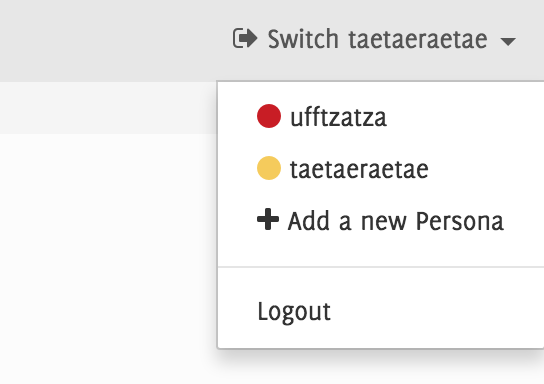
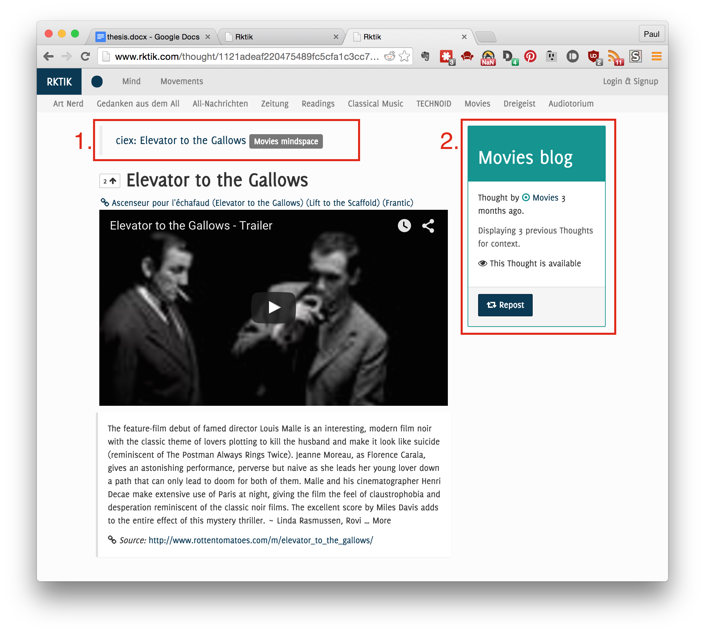
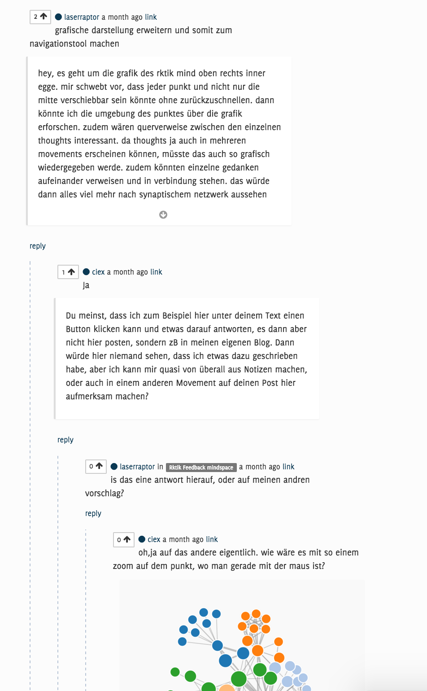

# Conceptual

## Overview

Rktik is an online community where users share text, links and other media pseudonymously in the context of topic-oriented groups and personal blogs. Contents are sorted and filtered based both on recency as well as a voting and subscription system.

This chapter will explain the user-facing functionality of the Rktik website on a conceptual level. First, general concepts are explained, introducing readers to the mechanics of using Rktik. Subsequent sections give detailed information on how Rktik handles *content*, *identity* and *context* respectively.

### Terminology

This section gives a brief overview of terminology used in Rktik. Please see the referred subsequent sections for more in-depth descriptions.\marginpar{See Section \ref{nucleus-models} for a diagram showing the relation of these concepts in Rktik.}

*Users* are individual persons using the site. They may register by creating a *user account* and one or more associated *personas*. Hereby, they are able to create content on the site. For details, see Section [User Accounts].

All content submissions of users are attributed to their *active persona*, which is a screen name that identifies them across the site. A user may create any number of personas to shape their privacy, but only one of them can be *active* at a time.

*Thoughts* are short pieces of text submitted by personas and represent the smallest unit of content. For details, see Section [Overview: Thoughts].

Thoughts can link to any number of *percepts*, which are attachments containing either more text or a hyperlink to an external resource. They are displayed alongside the thought. For details, see Section [Attaching Media: Percepts].

Personas can *vote* on thoughts to make them more visible to other users. Every thought has a numerical *hotness* value, which decreases with time after posting and increases with every vote gained. This value is used for sorting many thought listings. For details, see Section [Distributing Attention: Voting and Hotness].

*Mindsets* are collections of thoughts. Any thought that is not a reply to another thought must be contained in a mindset. Every persona has a private and a public mindset (*Mindspace* and *blog* respectively). For details, see Section [Context].

*Movements* are groups related to a specific topic. Each has a private mindset for members and a public mindset (blog).

Any persona can create new movements and follow the blog of any movement or other persona. For details, see Section [Movements].

### Frontpage

Rktik’s *frontpage* is located at the root URL <rktik.com> and presents users with a stream of thoughts from their movements and followed blogs. It is similar to the *Facebook News Feed* and the *Reddit frontpage* in that the stream is sorted based both on the recency of a submission and the number of votes it has received (see Section [Distributing Attention: Voting and Hotness]).

As unregistered users do not have any subscriptions, they are shown thoughts from *top movements*, which are the seven movements with the highest member count.

On the right-hand side of the thought stream, the frontpage also contains these other elements:

* *Frontpage graph visualization*:
A visual representation of all thoughts and authors on the page as a graph (see Section [Frontpage Graph Visualization]).

* *Top Thought*:
When a user is logged in, this contains a short list of thoughts from *top movements* they are not following with their active persona. This allows users to notice particularly popular submissions from contexts they would not see otherwise.

* *Discover Movements*:
A listing of *top movements* the active persona is not following.

* *Recent Thoughts*:
The most recent publicly visible thoughts submitted throughout the whole site.

#### Frontpage Graph Visualization

![Frontpage graph visualization]

The frontpage contains a visual representation of its contents in the form of a graph. This layout communicates the flow of information from a persona’s subscriptions to their frontpage. It also shows some additional thoughts from these subscriptions, that are not *hot* enough to be included in the frontpage. The following will describe the layout and meaning of the graph’s elements.

The graph represents the frontpage as a big red node in the center, identities which are followed by the active persona (content sources) as medium-sized colored nodes and thoughts as small white nodes.

Thoughts are connected to the center with a dotted edge if they are currently part of the frontpage feed. Thoughts are also always connected to their author’s identity with a further dotted edge. Some of the identities that are followed by the active persona may have contributed no thoughts to the current frontpage. In this case, they are connected to the center with a faint dashed edge. Nodes representing thoughts have a pulsating animation with a frequency correlated to their hotness and capped at 5 Hz.

In summary, the frontpage contents surround the center node as a ring of white nodes, pulsating faster or slower according to their position in the stream. They are connected to a second ring of nodes, which consists of movements and personas who submitted the thoughts. Other content sources and thoughts are located a bit further away to show that they are also eligible for inclusion in the frontpage.

### Notifications

Notifications catch the user’s attention in order to present information that is personally relevant. They are displayed in a drop down menu in the top left corner of every page and some of them are also sent as email notifications  [^optout].

[^optout]: A user may opt out of receiving emails about notifications of a specific type. See Section [User Accounts].

There are four notification types:

* *Reply*: Sent when another user replies to one of the active user’s thoughts.
* *Mention*: Sent when someone uses the *@\<username\>* syntax in a thought to notify a persona directly.
* *Dialogue*: Sent when a new thought is added in a private conversation.
* *Follower*: Sent when a persona’s Blog gains new followers.

See Section [Notification] for implementation details.

## Content

### Overview: Thoughts

*Thoughts* are the basic building block for content in Rktik and roughly equivalent to a post on Facebook or submission on Reddit. They consist of a short text, limited to 300 characters, and any number of percepts (attachments). Thoughts are displayed 1) on the frontpage, 2) as part of blogs and Mindspaces, 3) on individual thought pages or 4) as part of a chat conversation (see Section [Context]).

The restriction on title length has been set for two reasons:

1. Page layouts can be simpler. Longer titles make the usage of separate display styles for long and short titles necessary. Implementing these increases development and maintenance time.
2. Short titles require users to be concise when formulating thoughts. In turn, they make it easier for other users to read and understand titles.

Thoughts can be created using the *create thought* page or the *inline thought creator*. All mindsets in which the active persona has editing rights contain a link to the create thought page. The inline thought creator is embedded in comments sections and as part of the *chat widget*. It allows posting text content up to the length of a thought’s title (300 characters), but lets users switch to the create thought page without losing their input if they wish to continue typing. The create thought page provides separate input fields for title and long-form text attachments.

### Reposts

Thoughts can be *reposted*, which creates a copy of the original thought in a different mindset. The repost is then attributed to the persona who created it. Reposts are always created as comments on their original, thereby notifying the original author. Users can always see the original thought from which a repost was created in the context area of the repost’s page (see Section [Context]).

### Attaching Media: Percepts

[TODO: Screenshot]

Thoughts may have any number of attachments to enrich their content. These are either rendered as part of the Rktik website or as links to other websites.

The following attachment kinds are supported:

* *Link*: This type can be attached by embedding a URL inside the thought title or long-form text.

	Links to pictures are rendered inline with the thought. Clicking the picture displays it enlarged in a modal gallery view. If multiple links to pictures are linked to a single thought, the modal view allows browsing through the picture gallery using keyboard and onscreen controls. The display size of pictures is also adapted to the size and number of image attachments (see Section [HTML Templates]).

	Links that point to the *soundcloud.com* and *youtube.com* domain will be rendered using the respective embeddable HTML widgets to allow playing music and videos without leaving the Rktik website.

* *Long-form text*: As thought titles are quite limited at 300 characters, the long-form text attachment allows adding more text content. This text may be formatted using Markdown syntax [@Gruber2004], which provides simple markup for basic text formatting such as headlines, enumerations, bold and italic text.

* *Mention*: Mentions let authors refer other users in their submission by using the @\<username\> syntax. This creates a link to the mentioned user in the thought and sends a notification to them.

* *Tag*: Prefixing any word in a text submission with the ‘#’ symbol adds this term as a tag label to the thought. The tag links to a list of all other thoughts with the same tag, thereby allowing users to link content in different areas of Rktik.

### Distributing Attention: Voting and Hotness {#hotness}

Personas may vote on thoughts, thereby expressing approval of their content. The number of votes is displayed next to every thought.

Apart from being a visible signal about the number of people who have expressed their approval, votes are also used for sorting thought listings. Depending on context, the order of listings is either chronological (chat), reverse chronological (blog) or by their *hotness* value, which is a combined measure of recency and number of votes (see Section [Thought]).

## Identity

Popular social media sites including Google+ and Facebook have tried to push users into publishing content on their services using a real name. The practice proved to be controversial with many users protesting the restrictions, and prevented people from decoupling their online and offline activities [@Boyd2012].

However, even though a pseudonymous naming system prevents directly linking offline and online identity, such a link can be established by other means: Online submissions may identify their author based on the uniqueness of the content alone, or link to other online contents that allow such identification.

Rktik introduces new tools that allow users to shape their privacy. Every user may create multiple online identities and use them to separate areas of their online activity. Users may also join their identities by publishing under the name of a movement and thereby further obfuscate connections to their offline identity. The following section will explain these concepts in detail.

### User Accounts

Any user of Rktik can register a personal user account which allows them to create content and vote on submissions. Creating an account requires a valid email address, a password and a name and color value for the user’s first persona. The color value is used for decorative purposes in the site’s design.

The account feature serves two main purposes:

1. Authorizing a user’s identity using their password and email-address. Authorized users may act on the site as one of the personas connected to the user account.
2. Obtaining a valid email address, so that users can be sent notifications and other messages related to their activity on the site.

User accounts also store the user’s email preferences, which allow them to disable emails of specific kind (see Section [Notifications]). In general, emails should be sent as little as possible as users may perceive them as spam if they carry insufficient personal relevance or value.

### Personas

The personal identity of a user is partially decoupled from their physical identity: While users may choose to use their real name, they can also use one or more pseudonyms.

Some online communities allow choosing an arbitrary name for user identities, while others require their users to provide their real name (see Section [State of the Art]). Rktik goes a step further by not only allowing arbitrary handle names but also arbitrary *numbers* of handles, which are called *personas*.

New users create their first persona on initial signup by giving it a name and assigning a color to mark its submissions. Following completed signup, users can create more personas using the *switch* menu in the upper right corner of every screen (see Figure \ref{switch-menu}). They can also choose to create a new persona when joining a movement. Therefore, they can keep their membership in that movement separate from activities in other parts of the site.

Other users cannot tell whether any two personas are linked to the same user account.

This functionality affords users of Rktik more freedom in managing their online identity than those of comparable social platforms. These freedoms may be used to act out different social roles or to voice unpopular opinions without fear of backlash against a user's offline identity. The notion that there is not necessarily a 1:1 mapping between offline and online identity is further established through the concepts of group identity and agency as described in the following section.

### Personal vs. Group Identity

Groups in online social networks communicate their identity through the contents they publish and markers in the group’s online representation (group name, picture, color scheme). Rktik furthers this concept by communicating not just a movement's identity but also its *agency*. The sense that a movement can think and act is established through 1) terminology in the user interface that suggests a shared mind and 2) features that let members use this shared mind to act collectively.

Language used in the context of movements implies that members have a shared mind: A movement's space for internal discussion is called *Mindspace* and users place contents in movements by *creating thoughts* in the Mindspace. This terminology implies that members control a shared mental space, which they can use to exchange thoughts. This notion is even stronger in private movements, where only members can read thoughts in the Mindspace.

A movement’s agency is implied in the functionality of the movement blog. Its contents are not dictated by a designated member of the movement, but selected collectively by voting on thoughts in the movement. The movement members make decisions collectively, which are then attributed to the movement as a whole. Please see section Section [Movement Agency] for possibilities for further development of the concept of movement agency.

### Movements

Movements allow groups of users with a shared interest to exchange their thoughts about it. Any user may create new movements by specifying a name and optional mission statement. A movement may also be created with the *private* option, which will hide contents of the movement Mindspace from non-members and only allow users with an invitation code to join the movement as a member. These invitation codes may be created by any movement member.

Users can access a movement by visiting its blog or Mindspace, the latter of which includes the movement’s chat room. Members can post thoughts to the movement Mindspace by using the *create thought* interface or posting to the movement chat. Mindspace contents are sorted by their hotness value (see Section [Distributing Attention: Voting and Hotness]).

#### Promoting Content

Movements automatically repost thoughts on their blog once they have reached a certain number of votes. A progress bar, displayed alongside each thought in the Mindspace, indicates how many more votes are required for promotion. This threshold value depends on the number of group members. Please see Section [Movement] for details on the implementation of the threshold function.

Movements are similar to Facebook Groups, Reddit’s Subreddit feature and Email newsgroups. All of them distinguish between private and public groups as Rktik does; however, they do not provide group members with the ability of democratically deciding to publish content publicly.

#### Private Movements

When creating a new movement, a user may choose to make it *private*, which 1) hides the movement Mindspace from non-members and 2) only allows users with a valid invitation code to enter the movement.

Invitation codes can be sent by movement members by either entering the email addresses of invitees or by copying a URL with an embedded invitation code and sending this to the invitee (e.g. using a messenger application).

The blog page of private movements indicates the movement founder so that users interested in joining may contact this founder and ask for an invitation.

## Context

Every thought is linked to the context in which it was created. This can either be the mindset in which a thought is submitted or another thought in the case of replies. Reposts have both kinds of contexts as they are created as replies on their original thought and simultaneously placed directly in a specific mindset, effectively linking discussion in two separate areas of Rktik.

Mindsets are collections of thoughts, owned by identities. There are three different kinds of mindsets for 1) internal thoughts of an identity (Mindspace), 2) its published thoughts (blog), and 3) private conversation (dialogue). Each of them is rendered with a particular layout and functionality.

This section will show how communication happens in the context of a single thought, as well as in mindsets. Then, the differences between the three kinds of mindsets are explained through their requirements, tasks and conceptual design.

### Threaded Discussion

Every thought in Rktik has its own page which collects all information related to the thought. This includes its text content and percepts as well as the thought’s context, metadata and reactions to it. Reactions may be replies, reposts or automatic promotions (see Section [Promoting Content]).

Displaying reactions to a thought in a flat listing can make it harder for readers to follow the exchange as conversations regarding different aspects of the original thought may be interweaved in the listing. Rktik solves this problem by using a hierarchical display of reactions: Direct replies are aligned to the left-hand side of the screen with subsequent replies indented to the right. Further, every subsequent subtree of the discussion is sorted by hotness.

For performance reasons, the reaction tree depth is limited to three levels. If a reaction is located in a mindset different from that of the original thought, reactions happening in the other context are also included up to a total depth of three levels.

If the original thought was created as a reply itself, the page also contains its parent thoughts. The thought’s author may define from 0-10 levels, how deep the reply-chain is recursed upwards for this purpose by setting the context-depth setting on the left side of a thought’s page. Setting it to zero hides the thought’s context from other users and removes it from the discussion pages of these ancestors (TODO: reference figure "context.png”).

### Contextual Rights Management

Depending on context, a different set of identities is authorized to create, edit and delete thoughts in a given mindset. See Section [Rights Management] for detailed information about which users are authorized for which actions.

### Mindspaces

Mindspaces are the first of three kinds of mindsets. They collect internal thoughts of an identity as opposed to thoughts published on a blog which is directed at a wider audience. Personas and movements are both identities in Rktik and therefore have their own Mindspace. The differences between personal and collective Mindspaces are described in what follows.

*Persona Mindspace*

Every persona has access to their private Mindspace in which only they can read and write. This makes it a space for collecting thoughts before deciding on whether or not, or in which context to publish them. The Mindspace of a persona is also referred to as the persona’s *notebook* to make it easier for new users to understand how they can use this feature.

Apart from creating thoughts directly in this mindset, users may also use the *repost* interface (see Section [Reposts]) to copy thoughts from anywhere on the site into their notebook.

*Movement Mindspace*

The movement Mindspace is the primary interface for movement members. This space is facilitating discussion and exchange between movement members and serving as a staging area for content that might be posted to the movement’s blog. The movement Mindspace should therefore 1) provide an overview of the most interesting content recently posted to the Mindspace and 2) provide members with a way to communicate directly and immediately. To fulfill both of these requirements, the layout displays thoughts both as a listing sorted by hotness as well as using a chat widget.

While the chat is an automatically updating view of the most recent thoughts, the listing changes more slowly. As the hotness ranking is based on recency and number of votes, it is akin to a rolling toplist of the currently most interesting thoughts. These thoughts can collect more votes in the listing view until they reach the threshold for promotion to the movement’s blog (see Section [Promoting Content]). A short blue bar displayed underneath each listing entry indicates how many further votes are required for a promotion.

#### Chat

The chat should provide members with a sense of direct and immediate participation in the movement. It provides an automatically updating, chronological listing of all events related to the movement, including all thoughts submitted to the movement Mindspace and thumbnails of media attachments.

This allows for a different mode of communication from the listing view and threaded discussion. The immediate transmission of messages allows the use of language with a conversational tone and creates the sense of a more direct exchange between participants.

Replies to any thought in the movement Mindspace are also displayed in the chat. They come with an annotation that explicitly marks them as replies and provides a hyperlink to their context. This allows movement members watching the chat to directly start participating in these discussions.

An inline form UI below the chat message listing allows users to send thoughts to the Mindspace/chat. Submitting the form clears the input without reloading the page, so that the user can enter another message immediately. Above the input, a notification text informs the user about the privacy of messages entered, which is dependent on whether the corresponding movement is private or not (see Section [Private Movements]).

### Blogs

Blogs are mindsets which allow identities to share their thoughts with a wider audience and are sorted in reverse chronological order. Any persona can follow any blog. Doing so places the blog’s contents in the pool of thoughts eligible for that user’s personal frontpage.

Personas can directly post new thoughts to their personal blog, while movement members can only indirectly place content in a movement’s blog through voting (see Section [Promoting Content]).

### Dialogue

While Mindspaces allow exchange *between* many users, and blogs allow broadcasting *to* many users, the dialogue mindset models a conversation between just two participants. As dialogues are also implemented as a mindset, messages can be reposted freely between a dialogue and any other context.

Apart from the different privacy setting, a dialogue provides the same affordances as the chat module in a movement Mindspace (see Section [Chat]).

Context                         Visible for
---                             ---
Blog                            Everyone
Mindspace (persona)             Only author
Mindspace (private movement)    Members
Mindspace (public movement)     Everyone
Dialogue                        Participants
Reply                           Determined by the original thought

Table: Context in Rktik

[Frontpage graph visualization]: img/graph.png
