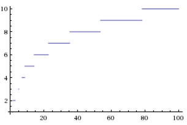
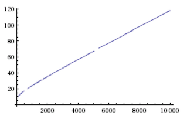
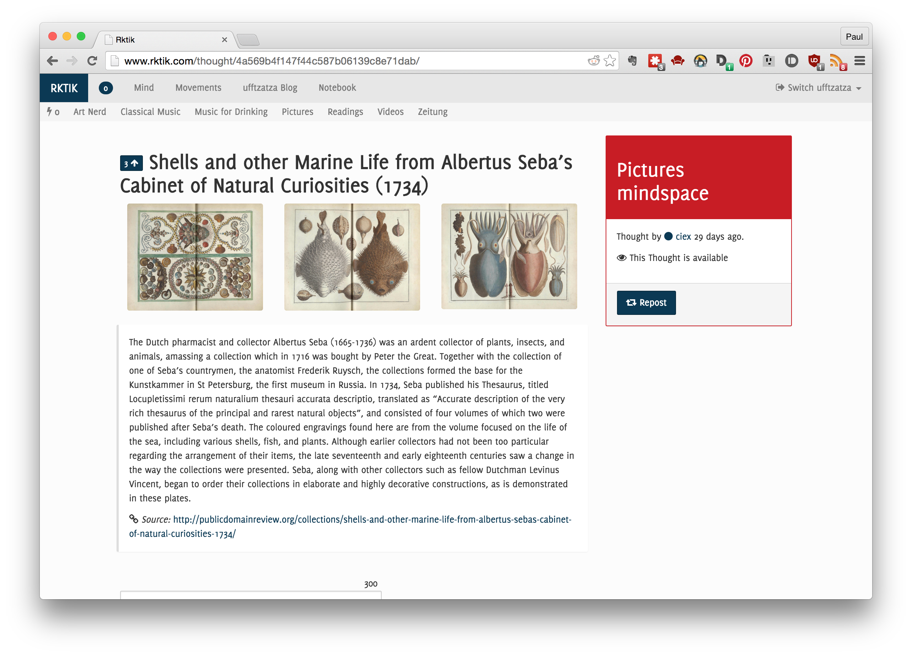
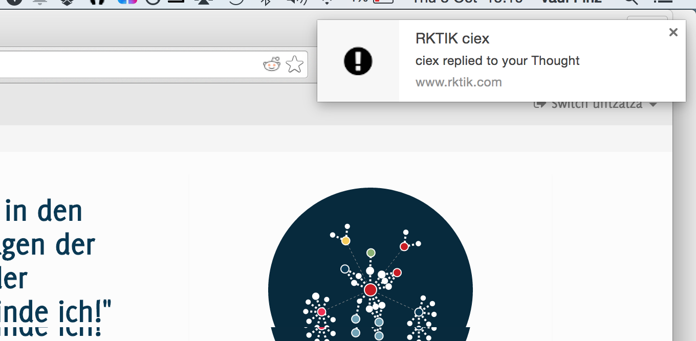

# Implementation and Operation

## Overview

This chapter gives technical information about the implementation and operation of the Rktik service.

The chapter starts with a section on the shared data model *Nucleus*. Following is a section on the *Glia* web server. Finally comes a description of performance improvements and the details of deployment and operation of Rktik in a hosted environment .

## Shared Data Model: Nucleus

The Nucleus library uses the SQLAlchemy ORM ^[[SQLAlchemy 0.9.2](https://pypi.python.org/pypi/SQLAlchemy/0.9.2)] to provide data persistency and defines methods for context-independent data processing. It is implemented as a Python package which can be imported from the main application *Glia*. The Nucleus package also provides a direct database connection that can be used from Glia to bypass the ORM layer, as well as a connection to the in-memory cache *memcache*. A signalling namespace provides event hooks which are used to automate post-processing and other tasks in reaction to model changes.

As Rktik was planned as a semi-decentralized service[^semi_decentral], the object relational manager was decoupled from the rest of the application from the beginning to allow for the easy implementation of client and server applications using this codebase.

The following subsections will describe the components of the Nucleus package, namely the *Serializable* module and ORM models. The last subsection will give general information about database development using the SQLAlchemy ORM.

[^semi_decentral]: Semi-decentral in this case means that users can chose between 1) a client application for rendering and processing data which uses a web server for the transfer of (encrypted) data and 2) solely using Rktik on its website without installing an application on their computers.

### Serializable

The *Serializable* module primarily provides serialization capabilities to ORM models that inherit from it. This functionality is not in the scope of this thesis, but part of the planned P2P extension (see Section [External Clients]). As the module is also required for rights management, I have left it in the codebase submitted along with this document, and will describe the relevant functionality here.

Serializable instances provide a method *authorize*, which validates that a given user may execute a specific action on the instance. An action may be creating, updating or deleting specific data stored in the instance, such as a persona's username or a thought's title. Each model that inherits from `Serializable` can define its own handling of user rights by overriding this method. Please see Section [Rights Management] for detailed information on which users are allowed to make changes to which objects.

### Nucleus Models

The module `nucleus.models` contains definitions for all ORM models. Each model is represented by a class definition. See Section [API specification] for technical details such as the attributes and methods provided by each model. This section gives an overview for each model’s properties and responsibilities with respect to the functionality described in the *conceptual* chapter.

![Class diagram of important classes and relations in Rktik as described in Section [Nucleus Models]. Most attributes and operations have been omitted for simplicity.](img/terminology.png)

#### User

The `User` model represents a registered user of the site. It has relations to all personas of this user and stores basic metadata such as the user ID, account creation data, email and password hash. The `User` class is also used in verifying user’s email addresses and storing the validation state related to the user.

#### Identity

The `Identity` class is a superclass for `Persona` and `Movement ` as these two share many attributes and methods related to them being identities.

Apart from basic information such as username, user color, creation and modification timestamps, the `Identity` model has relations to the blog and mindspace associated with each instance.

#### Persona

The `Persona` class represents personal identities taken by users of the site. Each `User` instance may be connected to many  `Persona` instances.

The `Persona` model provides methods for toggling instances’ memberships in movements and following and unfollowing blogs. It also provides a number of cached methods that serve as shortcuts to information related to the Persona which is computationally expensive to collect (see Section [Improving Performance]).

#### Movement

Just as the `Persona` model, `Movement` instances inherit from the `Identity` model and thereby provide all its attributes and methods. They also store the movement’s mission, whether the movement is private and relations to the movement’s admin (founder) and to movement members.

When votes are cast on thoughts in the movement mindspace, the movement’s `promotion_check` method is called. This method reposts the thought to the movement blog, if the number of votes passes a threshold. Given the number of members (c) the threshold value (t) is defined as:

    t = round(c / 100 + 0.8 / c + log(c, 1.65)) if c > 0 else 1

This formula ensures that for a small movement a low number of votes is required, thus creating lots of content on the blog.  At the same time larger movements need more votes relative to their user count, so that only the best content will be posted to the blog.

 \

Plot of threshold function for c = 1 to 100.

 \

Plot of threshold function for c = 100 to 1000.

**Movement Member Association**

The members relation is implemented using the [association object pattern](http://docs.sqlalchemy.org/en/rel_1_0/orm/basic_relationships.html#association-object) to store additional metadata about the membership. This pattern uses an additional table to represent relations between two entity classes. This table can be used to record additional information about the relation:

* `active` (Boolean): Inactive memberships are used to represent former members and for invitations. The latter are created as inactive memberships with no associated persona.
* `created`, `modified`: Timestamps for creation and last modification of the membership.
* `role`: The member’s role in the movement (currently one of “member” and “admin”).
* `last_seen`: Time when the persona was last present in the movement chat

#### Mindset

This model represents a *set of thoughts* with an author and is a superclass of `Mindspace`, `Blog` and `Dialogue`.

* **Mindspace** models internal thoughts of an identity
* **Blog** models a blog publication
* **Dialogue** models a conversation between two identities. The dialogue model has an additional relation to personas representing the “other” of a conversation. This means that retrieving the dialogue between two given personas is not a simple lookup, as the `author` and `other` attribute can be filled interchangeably. Therefore, a `get_chat` classmethod is provided that probes the two lookup possibilities in succession and returns a new dialogue instance if both are unsuccessful.

#### Thought

The `Thought` model represents content submissions by users of the site. Each instance stores the title text and metadata of the thought. All other media related to the thought is contained in `Percept` objects. Thoughts also store the context they were posted in, which may either be a parent thought for replies or a mindset for top-level thoughts.

The thought class is able to generate instances of itself directly from text input received via the UI through a class method. This process includes detecting embedded URLs and validating whether they refer to a *valid* HTTP resource, creating `Percept` objects for any text, link or linked picture attachments, relaying notifications triggered by the creation of new thought and percept instances and invalidating caches touched by the new thought.

Thoughts also have a relation to their votes and helper methods for accessing information about these votes (eg. whether a given user has voted or the total amount of votes). This also includes a method to return the *hotness* value of a thought.

Hotness is a numeric value that depends on the recency of a thought and the number of votes it has received.  Accordingly, hotness values are higher for more recent thoughts or thoughts with more votes. Thoughts with equal numbers of votes are effectively sorted in reverse chronological order, while each additional vote pushes the thought upward in the ordering.

Given the number of votes (v) and the number of hours since the thought was created (t), a thought’s hotness is:

	hot = v / pow(t + 2, 1.5)

This algorithm is adapted from the sorting algorithm used in the social bookmarking site Hacker News^[<https://news.ycombinator.com/>] [see @Salihefendic2010].

#### Upvote

The `Upvote` model inherits from `Thought`. Its instances represent votes cast by personas on other thoughts. This relation is represented by the upvote instance referring to the voted thought as its parent.

#### Percept

The `Percept` model represents attachments on thoughts. The `Percept` class is thereby used as an abstract class with following subclasses:

* `LinkPercept`, `LinkedPicturePercept`: Store a URL link, which is rendered inline in case of the `LinkedPicturePercept`
* `TextPercept`: Stores the attached text
* `MentionPercept`: Stores a relation to the linked user and the text used to refer to them (these might be different if the mentioned persona changes their username after being mentioned)
* `TagPercept`: Store a relation to an instance of the `Tag` model (see Section [Tag]).

Percepts are linked to a thought with the association object pattern. The `PerceptAssociation` class stores the author who created the association in addition to its thought and percept. The association’s author is usually identical with the thought author, but movement admins also have the rights to edit thoughts submitted to their movement’s mindspace.

#### Tag

The `Tag` model represents labels attached to thoughts. Tags can be created by adding the hash character ‘#’ as a prefix to any word in the thought title or text. Tagged thoughts do not have a direct relation with a tag instance but use the `TagPercept` model as an association object. This way, tags can be renamed globally without modifying all thoughts that have this tag.

#### Notification

Notifications represent direct messages to the user, generated automatically when certain events require the user’s attention. The `Notification` base class stores metadata such as the notification text, URL, unread status and recipient. Subclasses are used to represent specific kinds of notifications:

* `MentionNotification`: Sent to a persona when a mention referring them is posted
* `ReplyNotification`: Sent to a persona when they receive a reply on one of their Thoughts.
* `DialogueNotification`: Sent for new messages in a private conversation between two Personas.
* `FollowerNotification`: Sent to a persona when their blog gains a new follower.

### Modeling Data with SQLAlchemy

SQLAlchemy allows the implicit specification of database schemas through defining the Python classes that the database ought to model. It maps user-defined Python classes to database tables and instances of these classes to rows in the tables. Changes to instances are transparently synchronized with database contents and queries for retrieving data can be formulated in an object oriented expression language. This has the advantages that 1) developers can start modifying the database schema without having to learn a query language specific to the used database, 2) the connected database backend can be changed with minimal modifications to the model specifications and 3) all code related to the ORM models resides in one place, thereby limiting code fragmentation.

While SQLAlchemy makes the creation of a database easy in the beginning of a project, it can later lead to performance problems. Reducing the complexity of database access is appropriate for straightforward use cases but can lead to inefficiencies in more complex scenarios. As SQLAlchemy does not necessarily translate a given command into the most effective query many advanced queries can be optimized with some knowledge of how the underlying database is used. The library provides an extensive suite of tools for implementing these optimizations.

When model definitions are changed while the database is already used in production, it is not enough to recreate the database using the new schema, as old data may have to be migrated. Rktik uses the Alembic library ^[[Alembic 0.7.5.post.2](https://pypi.python.org/pypi/alembic/0.7.5.post2)] to record schema changes and migrate the database layout. Schema migrations are automatically executed on the server by the deployment script (see Section [Hosting and Deployment]).

In cases where not only the database schema, but also its contents have to be modified, migration scripts have to be manually written in accordances with the changes. These are stored in the `glia/migrations_extra` directory for one-time execution on the server.

## Web Server: Glia

The *Glia* web server is a Python package based on the Flask web framework, and responsible for:

* collecting and computing contents of the user interface,
* serving asynchronous UI updates,
* validating, storing and modifying information entered by the user,
* automatically performing maintenance operations, and
* scheduling email delivery.

Glia consists of the following components:

- *Views* are functions mapped to URL patterns and compute their contents when accessed by a user
- *Websocket events* are special views used for asynchronous communication with a web browser
- *Forms* validate restraints on structured user input
- *HTML Templates* are used to map data into a graphical layout to be rendered by a browser
- *Configuration files*
- *Database migration scripts*
- *Static files* (Images, frontend Javascript resources, etc)

**Session Management**

Session management is responsible for storing information about which user is logged in on which browsers. Rktik uses the Flask-Login extension ^[[Flask-Login 0.2.11](https://pypi.python.org/pypi/Flask-Login/0.2.11)] to provide most of this functionality.

Users can login using their email and password, which will let Flask-Login store a cookie in their browser recording the logged-in state.

### Web View and URL Routing

Views are functions that return HTML content and are mapped by a route to a URL scheme, which can be accessed by a user through a web browser.

The following section lists a description of all views available in Glia. Some of these are *redirect views*, which do not return a web page to the browser but redirect it to a different URL.

* **index** Frontpage at ([http://rktik.com/](http://rktik.com/))

*Personas*

* **create_persona** Form for adding a new persona
* **notebook** Private area for storing notes and reposting thoughts for oneself
* **notifications** Listing of notifications for active persona and email preferences for logged in user account
* **persona** Basic information about a single persona and listing of all movements they are a member of. This view includes a chat widget for private conversations with other users.
* **persona_blog** Personal blog of a persona

*Thoughts*

* **create_thought** Dedicated page for creating new thoughts. In contrast to the inline thought creator this view also allows entering long text attachments.
* **edit_thought** Similar interface to the *create_thought* view that allows removing and editing attachments and the thought’s title.
* **delete_thought** Confirmation dialog for removing thoughts.
* **thought** View for a single thought that includes its context, attachments, comments and the thought’s metadata.

*Movements*

* **movement** Redirect view that sends members to a movement’s mindspace and non-members to the movement blog.
* **movement_blog** Main listing for a movement’s blog that presents a reverse chronological, paginated view of thoughts in the blog. Also allows following the movement and becoming a member.
* **movement_mindspace** View for movement mindspace contents as well as movement chat and basic movement metadata.
* **invite_members** Form for obtaining invitation links for a movement and sending email invitations.
* **movement_list** List all movements registered on Rktik

*User account related*

* **activate_persona** Redirect view that activates a different persona registered to the logged in user account
* **signup** Form for creating a new user account
* **signup_validation** Redirect view for validating a user’s email address
* **login** Login form for user accounts
* **logout** Redirect view that logs out the current user account

*Helpers*

* **help** Access help pages stored in *templates/help_\*.html* files
* **tag** Listing of thoughts marked with a specific hashtag

*Before request*

These special views have the `before_request` decorator, which causes them to be executed every time a user visits a page.

* **account_notifications** Inserts a notification into the page if the logged in user has not validated their email address
* **mark_notifications_read** Marks all notifications as *read* which have a URL equal to the current page

### HTML Templates

Templates allow separation of content and layout in the application backend and thereby lead to more readable code. They consist of layout definitions written in HTML and additional markup that defines where content needs to be inserted. View functions compute all information neccessary for a given web page and then pass this information as parameters to a template. Rktik uses the Jinja2 template engine ^[[Jinja2 2.8](https://pypi.python.org/pypi/Jinja2/2.8)] included with Flask for this purpose.

Jinja2 provides almost all required functionality with missing features made available through extensions. Rktik uses the *humanize* library ^[[Humanize 0.5](https://pypi.python.org/pypi/humanize/0.5)] for converting date and time data into a human readable format ^[As an example, instead of displaying `2015-10-01T15:42:23.254966+00:00` as a thought’s creation time, the relative form *two hours ago* is used]. Additionally, a number of custom filters are used in templates:

* Rktik stores all date and time information in the GMT timezone. This allows handling time information in the backend without considering time zones. A custom filter is used to convert these to European central time in the template.
* The *mentions* filter uses information from mention percepts (see Section [Nucleus Models]) to replace occurrences of the pattern `@persona_name` with a link to the respective persona’s page
* The *gallery_col_width* filter is used to adapt the size of image attachments to their number. The largest format is used when only one image is attached. A successively smaller image size is used up to four image attachments.

	
* The *sort_hot* filter can be used to apply the hot ranking to lists of thoughts
* The *authorize* filter replaces thought contents with a placeholder if the thought is not visible to the active persona (see Section [Serializable]).

### Asynchronous UI

Most of the content of Rktik is compiled on the server and then sent as a complete web page to the user’s browser. When an interaction requires only part of the screen contents to be changed, site responsiveness is increased by using asynchronous communication with the server. This functionality is implemented using the *jQuery* Javascript library ([jQuery website](https://jquery.com/)) for one-off asynchronous calls and the *websockets* browser technology for continuous streams of information.

The websockets technology provides a socket between the browser and the Glia server which is used for relaying information during the time in which the browser window stays open. All thoughts created in a movement mindspace including chat messages as well as all votes on these thoughts, are received and immediately relayed by the server to all browser windows that show part of the movement. Messages received on the client side are inserted into the chat widget. If the browser window shows an individual thought’s page, new comments are inserted at the appropriate place in the hierarchical comments view.

The same channel is used for sending reposts and receiving desktop notifications (see Section [Notifications]). Server side handlers for websockets are located in the `glia.web.events` module, while client side handlers are located in the static file `glia/static/js/main.js`.

Other asynchronous calls are handled using jQuery based javascript functions. This includes:

* Loading more chat contents ^[The chat window initially loads the most recent 50 messages, at the top of which a button triggers loading another 50].
* Changing a movement’s mission description.
* Changing a persona’s username.
* Changing the amount of context ^[If a thought is a reply, its context are those thoughts to which it is replying.] displayed above the thought title on individual thought pages.
* Following and unfollowing blogs.
* Toggling membership in a movement.

The server side handlers for this functionality are located in the `glia.web.async` module, while the client side handlers are located in the `glia/static/js/main.js` script.

### Notifications

Notifications are direct messages from the system to individual users and inform them about reactions to their thoughts, as well as other relevant messages. They are relayed as desktop notifications  and/or as email messages. Email messages provide the further advantage of being a way to contact users who are not visiting the site regularly.

Desktop notifications are displayed using the PNotify library ([PNotify](http://sciactive.github.io/pnotify/)), which can insert notifications as HTML elements in web pages or as operating system specific native UI elements outside the browser window, as specified in the W3C recommendation *Web Notifications* (see @W3C). When users first visit the Rktik website, they are prompted to allow displaying web notifications. HTML based notifications are used if this request is denied. Desktop notifications are relayed to the browser using websockets. The javascript functions used for receiving and displaying notifications are located in the `glia/static/js/main.js` script.

Email notifications are delivered using the *SendGrid* email delivery service ([SendGrid website](https://sendgrid.com/)). Using this service ensures that all users can receive email notifications reliably. While an email implementation integrated with the Rktik service would be technically feasible, this approach would not guarantee that messages pass spam filters of users’ email providers. This functionality is implemented in the `glia.web.helpers` module.

The user may opt out of email delivery entirely or set up specific rules for the kind of emails they want to receive. These settings can be made in the notifications view. This page is linked from the notifications drop-down and from the footer section of all email notifications sent by Rktik.

## Improving Performance

User satisfaction is related to a web site’s performance (@NIELSEN2012). As the complex page layouts and *hot* sorting used in Rktik require significant server resources, keeping performance at a satisfactory level is hard. As the development process of Rktik did not define performance as a primary objective (see Section [Methodology]), the neccessary adjustments are even more difficult to make. Still, it was possible to increase performance at the end of the development process by 1) using memcache to reuse computed results and 2) optimizing database queries.

**Caching**

The memcache system is an in-memory key value store to hold computed results for fast access. Entries in memcache persist until they are overwritten, their expiry date is reached or they are deleted because available memory is not sufficient for new entries. Rktik uses the Flask-Cache library to access memcache ([Flask-Cache 0.13.1 website](https://pypi.python.org/pypi/Flask-Cache/0.13.1)). Caching is used if results 1) are changing slowly ^[As an example, the frontpage graph structure is cached for one hour per persona as the frontpage changes slowly and omissions are not considered critical.] , 2) are expected to be reusable in the near future, and 3) can be reliably invalidated once they change.

Cached data is invalidated by processes that change its contents. See Section [Cached Information] for a list of cached functions and the processes that trigger their invalidation. Cache contents are automatically invalidated after an amount of time that ranges from minutes to days.

**Database Query Optimization**

The SQLAlchemy library hides the complexity of accessing data stored and linked across multiple tables. While this eases the development process significantly, it can lead to inefficient patterns of database usage. Specifically, the number of queries required to access data can be in a linear relation to the number of items retrieved. Often, such queries can be combined into a single query or a low number of queries by using *eager loading* techniques offered by SQLAlchemy (@SQLAlchemyAutors). Here, a *JOIN* statement is issued to simultaneously load related data from the database. Rktik is configured to utilize eager loading 1) for specific queries, using the SQLAlchemy `joinedload` option, and 2) for certain model properties in general by specifying the option as a parameter in Nucleus’ model definitions.

## Hosting and Deployment

Rktik ist running on servers provided by the Heroku platform-as-a-service (PAAS) ^[[Heroku website](https://www.heroku.com)). In contrast to traditional server environments, which need to be manually configured for the services to be deployed, a PAAS offers tools that automate many of these tasks. This includes deployment from a Git repository, automatic installation of dependencies, a web interface for installation and semi-automatic configuration of third-party services (e.g. email delivery, memcache, log analysis, etc.) and a mechanism for simple and fast scaling of an application’s resources in the event of rising visitor traffic.

These capabilities allow developers to focus on programming instead of the time-consuming configuration and maintenance of a server environment. The downside of using Heroku is that their services come at a comparatively high price. This downside is mitigated, as Heroku is offering a free option for applications that require only little resources as is the case for Rktik right now. However, if Rktik grows to a larger userbase, it might become necessary to move to a different hosting environment that offers a better cost-benefit ratio.

Rktik is installed in two separate Heroku environments for *testing* and *production* use. The development process consists of testing a new feature on a local development machine, testing it in the testing environment and only then deploying it to the production environment if no bugs are found (see Section [Methodology]). The production environment has been accessible to the general public since July 26th 2015.

Deployment to these environments is automated using the scripts ‘push_testing.py’ and ‘push_production.py’ in the source code’s root folder. These scripts execute all tasks neccessary for deployment which includes:

* Verifying that all changes to the Nucleus repository are committed in Git
* Pushing the Nucleus repository to Github
* Checking that all changes to the Glia repository are committed in Git
* Pushing the Glia repository to the appropriate environment on Heroku. This step triggers the Heroku environment to automatically install all required dependencies ^[Dependencies are defined in the file `requirements.txt` in the Glia project root folder].
* Running database migration scripts in the Heroku environment

The script for deployment to the production environment additionally merges all changes in the *development branch* into a new commit on the *master branch* of the Glia repository (see Section [Methodology]). Therefore, commits on the master branch represent a history of deployments to the production environment and can be seen as versions of the Glia application.

Rktik uses *environment variables* to determine which environment it is currently running in and to load an appropriate configuration. There are differing configurations for the development, testing and production environment. They differ in the passwords, secrets and external services they specify, as well as the internet hostname they set up for Rktik. Sensitive information such as passwords is not stored in the source code repository, but loaded either from access-controlled external files or environment variables.

The development and testing configurations additionally increase the verbosity of log messages and provide interactive debugging in two ways: 1) a debugging console and interactive traceback embedded in Flask’s response when server errors occur during a request and 2) the Flask DebugToolbar (@VanTellingen2015), which provides an interface for performance measurement, variable introspection and other information as an optional web overlay for successful requests.

All logging messages above the *debug* severity level are also forwarded to the Rktik engineering channel in the Slack web service ^[The [Slack web service](https://slack.com) provides chat rooms which can be integrated with external web services], which is not visible to the public. This allows monitoring of errors in Rktik from a mobile phone or any computer with an internet connection.
