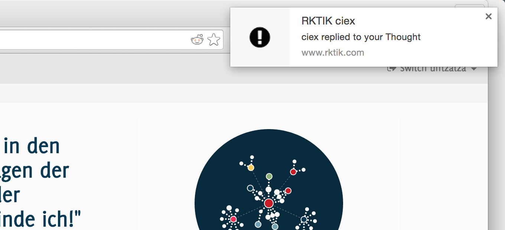

# Implementation and Operation

## Overview

This chapter contains technical information about the implementation and operation of the Rktik service.

The chapter starts with a section on the shared data model *Nucleus*. Following is a section on the *Glia* web server. Finally, it gives descriptions of performance improvements and the details of deployment and operation of Rktik in a hosted environment.

Portions of this chapter that refer to source code either point at the relevant file path, relative to the Glia or Nucleus project root folders, or use Python’s dot notation, where `glia.web.helpers` refers to a file `helpers.py` in the folder `glia/web/`. Javascript definitions can be found in the file `glia/static/js/main.js` contained in the Glia project unless specified otherwise.

## Shared Data Model: Nucleus

The Nucleus package^[Git project with source code available at <https://github.com/ciex/nucleus>] provides data persistency and defines methods for data processing directly related to the data models. It is implemented as a Python package that is imported from the main application *Glia*. 

Nucleus uses the SQLAlchemy Object Relational Mapper (ORM)^[[SQLAlchemy 0.9.2](https://pypi.python.org/pypi/SQLAlchemy/0.9.2)] with the Flask extension Flask-SQLAlchemy^[<https://pypi.python.org/pypi/Flask-SQLAlchemy/1.0>] to connect model definitions to a persistent database backend. The package furthermore provides a direct database connection, used in Glia to bypass the ORM, as well as a connection to the in-memory cache *Memcached*^[<http://memcached.org/>]. A signaling namespace provides event hooks which are used to automate post-processing and other tasks in reaction to model changes.

The Nucleus package was originally created because Rktik’s predecessor Souma was planned as a semi-decentralized service: Users could have chosen between accessing Rktik with a native client application that uses a centralized server for the transfer of (encrypted) data and solely using Rktik via its website, without installing an application on their computers. Due to this original plan, model definitions were decoupled from the rest of the application to allow for the easy implementation of client and server applications using this codebase. An extension of Rktik into a semi-decentralized service is outlined in Section [External Clients].

The following subsections will describe the components of the Nucleus package, namely the *Serializable* module and ORM models. The last subsection will give general information about database development using the SQLAlchemy ORM.

### Serializable

The *Serializable* module primarily provides serialization capabilities to ORM models that inherit from it. This functionality is not in the scope of this thesis, but part of the planned P2P extension (see Section [External Clients]). As the module also enables access rights management, it is included in the codebase submitted along with this thesis and the relevant functionality is outlined in the following.

Serializable instances provide a method *authorize* that validates whether a given user may execute a specific action on it. An action may be *creating*, *updating* or *deleting* specific data stored in the instance, such as a persona's username or a thought's title. Every model that inherits from `Serializable` can define its own handling of user rights by overriding this method. See Section [Rights Management] for detailed information on which users are allowed to make changes to which objects.

### Nucleus Models

The module `nucleus.models` contains class definitions for all ORM models. See Figure \ref{class-diagram} for an overview of the models. This section gives an overview of their properties and responsibilities with respect to the functionality described in the *conceptual* chapter. Additional capabilities that are not directly related to features described in Part [Conceptual] are omitted for brevity.

![Class diagram of important classes and relations in Rktik as described in Section [Nucleus Models]. Some attributes and operations have been omitted for simplicity. \label{class-diagram}](img/terminology.png)

#### User

The `User` model represents a registered user. It has relations to personas of this user and stores metadata such as the user ID, account creation date, email and password hash. The `User` class can also verify user’s email addresses and store the validation state of the user account.

#### Identity

The `Identity` class is a superclass for `Persona` and `Movement. Apart from basic information such as username, user color, creation and modification timestamps, the model has relations to the blog and Mindspace associated with each instance.

#### Persona

The `Persona` class represents personal identities of users. Each `User` instance may be connected to many  `Persona` instances.

`Persona` instances provide methods for toggling their membership in movements, as well as following and unfollowing blogs. They also offer cached access to some information related to personas, as described in Section [Improving Performance].

#### Movement

The `Movement` class inherits from the `Identity` class just as `Persona` and thereby provides all its attributes and methods. Its instances also store the movement’s mission, whether the movement is private and provide relations to the movement’s admin (founder) and to movement members via the `MovementMemberAssociation` class.

When votes are cast in a movement Mindspace, the movement’s `promotion_check` method is called. This method reposts the voted thought to the movement blog if the total number of votes passes a threshold. Given the number of members (c) the threshold value (t) is defined as:

\hfill

$\mathlarger{t =
\left\{\begin{matrix}
round(\frac{c}{100} + \frac{0.8}{c} + log_{1.65} c) &, \mbox{for } c > 0 \\
1 & , \mbox{otherwise}
\end{matrix}\right.}$

\hfill

For a small movement a low number of votes is required, thus creating lots of content on the blog. Larger movements need more votes relative to their user count, so that only the best thoughts are posted to the blog. As the threshold function is based on intuition, it might be necessary to adjust it in the future. See Figures \ref{threshold-1} and \ref{threshold-2} for plots of the function.

**Movement Member Association**

The `members` relation is using the *[association object pattern](http://docs.sqlalchemy.org/en/rel_1_0/orm/basic_relationships.html#association-object)* to store additional metadata about the membership. This pattern uses an additional database table for representing relations between two entity classes. In this table the following information is stored about every membership:

* `active`: Inactive memberships are used to represent former members and for invitations.
* `created`, `modified`: Timestamps for creation and last modification of the membership.
* `role`: The member’s role in the movement (currently one of “member” and “admin”).
* `last_seen`: Time when the persona was last present in the movement chat.
* `invitation_code`: MovememtMemberAssociation instances that represent movement invitations store an invitation code used to authenticate the invited user. 

#### Mindset

This model represents a *set of thoughts* with an author and is a superclass of `Mindspace`, `Blog` and `Dialogue`.

* **Mindspace** models internal thoughts of an identity.
* **Blog** models a blog publication.
* **Dialogue** models a conversation between two identities. The dialogue model has an additional relation to personas representing the “other” of a conversation. As the `author` and `other` attribute can be filled interchangeably, retrieval of the dialogue between two given personas is not possible with a simple lookup by. Therefore, a `get_chat` class method is provided that probes the two lookup possibilities and returns a new dialogue instance if both are unsuccessful.

#### Thought

The `Thought` model represents content submissions. Each instance stores the title text and metadata of the thought. All other media related to the thought is contained in linked `Percept` objects. Thoughts also store the context they were posted in, which is either a parent thought or a mindset.

The thought class has a class method to generate instances of itself directly from user’s text input. This process includes: 

* Detecting embedded URLs and validating whether they refer to a valid HTTP resource.
* Creating `Percept` objects for any detected attachments.
* Relaying notifications triggered by the creation of new thought and percept instances.
* Invalidating caches touched by the new thought.

Thoughts also have a relation to their votes and helper methods for accessing information about these votes (e.g. whether a given user has voted or the total amount of votes). This also includes a method to return the *hotness* value of a thought.

Hotness is a numerical value that depends on the recency of a thought and the number of votes it has received.  Accordingly, hotness values are higher for more recent thoughts or thoughts with more votes. Thoughts with equal numbers of votes are effectively sorted in reverse chronological order, while each additional vote pushes the thought upward in the ordering.

Given the number of votes (v) and the number of hours since the thought was created (t), a thought’s hotness is defined as:

\hfill

$\mathlarger{hot = \frac{v}{(t+2)^{1.5}}}$

\hfill

This algorithm is adapted from the sorting algorithm used in the social bookmarking site Hacker News^[<https://news.ycombinator.com/>] [see @Salihefendic2010].

#### Upvote

The `Upvote` model inherits from `Thought`. Its instances represent votes cast by personas. This relation is represented by an `Upvote` instance referring to the voted thought as its parent. The model is called “Upvote” instead of “Vote”, as the Souma project considered implementing both positive and negative votes.

#### Percept

The `Percept` model represents attachments on thoughts. It is used as an abstract class with following subclasses:

* `LinkPercept`, `LinkedPicturePercept`: Store a URL link, which is rendered inline in case of the `LinkedPicturePercept`.
* `TextPercept`: Stores longer text.
* `MentionPercept`: Stores a relation to the linked user and the text used to refer to them (which might be different if the mentioned persona changes their username after being mentioned)
* `TagPercept`: Store a relation to an instance of the `Tag` model (see Section [Tag]).

Percepts are linked to a thought with the association object pattern. The `PerceptAssociation` class stores the association’s author in addition to its thought and percept. The association’s author is usually identical with the thought author, but movement admins also have the right to edit thoughts posted to their movement’s blog.

#### Tag

The `Tag` model represents labels attached to thoughts. Tags can be created by adding the hash character ‘#’ as a prefix to any word in the thought title or text. Tagged thoughts do not have a direct relation to a tag instance, but use the `TagPercept` model as an association object. This allows global renaming of tags without modifying database entries for all thoughts that have this tag.

#### Notification

Notifications represent direct messages to a user that are generated automatically when events require their attention. The `Notification` base class stores metadata such as the notification’s text, URL, whether it has been read and its recipient. Subclasses represent specific kinds of notifications:

* `MentionNotification`: Sent when a persona is mentioned using the @\<persona\> syntax.
* `ReplyNotification`: Sent when a persona receives a reply.
* `DialogueNotification`: Sent for new messages in a private conversation between two Personas.
* `FollowerNotification`: Sent when a blog gains new followers.

### Modeling Data with SQLAlchemy

SQLAlchemy allows the implicit specification of database schemas through defining the Python classes that the database ought to model. It maps user-defined Python classes to database tables and instances of these classes to rows in the tables. Changes to instances are synchronized with database contents and queries for retrieving data can be formulated in an object oriented expression language. This has the following advantags: 1) developers can modify the database schema without having to learn a query language specific to the connected database backend, 2) the database backend can be swapped out with minimal changes to the models, and 3) all code related to the ORM models resides in one place, thereby limiting code fragmentation.

Reducing the complexity of database access is appropriate for straightforward use cases but can lead to inefficiencies in more complex scenarios, such as those created by relations spanning multiple database tables. As SQLAlchemy does not necessarily translate a given command into the most effective query, many of them can be optimized with some knowledge of how the underlying database is used. The SQLAlchemy library provides an tools for implementing these optimizations.

Rktik uses the Alembic library ^[[Alembic 0.7.5.post.2](https://pypi.python.org/pypi/alembic/0.7.5.post2)] to record schema changes and migrate the database layout. Schema migrations are automatically executed on the server by the deployment script (see Section [Hosting and Deployment]).

When model definitions are changed during production use, it is not sufficient to recreate the database using the new schema, as old data may have to be migrated. In this case migration scripts have to be manually written in accordances with the changes. These are stored in the `glia/migrations_extra` directory for one-time execution on the server.

## Web Server: Glia

The *Glia* web server is a Python package based on the Flask web framework and responsible for:

* Serving HTTP requests by collecting and computing contents of the user interface.
* Serving asynchronous UI updates (see Section [Asynchronous UI]).
* Validating, storing and modifying information submitted by users.
* Automatically performing maintenance operations
* Scheduling email delivery.

These tasks are handled by a number of modules. The following lists the most important ones and refers to their location in the source code. Please refer to Figure \ref{components} for a graphical overview.

- *Views* are functions mapped to URL patterns and compute their contents when accessed by a user.
- *Websocket events* and *asynchronous views* are special views used for asynchronous communication with a web browser.
- *Forms* validate restraints on structured user input.
- *HTML Templates* are used to map data into a graphical layout to be rendered by a browser.
- *Configuration files*
- *Database migration scripts*
- *Static files* including images, CSS stylesheets, Javascript resources, etc.

**Session Management**

Session management is responsible for storing information about which user is logged in on which browser. Rktik uses the Flask-Login extension ^[[Flask-Login 0.2.11](https://pypi.python.org/pypi/Flask-Login/0.2.11)] to provide most of this functionality.

Users can login using their email and password, which will let Flask-Login store a cookie in their browser recording the logged-in state.

### Web View and URL Routing

Views are functions that return HTML content given an HTTP request. They are mapped by a *route* to a URL scheme, which can be accessed users through a web browser.

The following section lists all views available in Glia. Some of these are *redirect views* that do not return a web page but redirect to a different URL.

* **index**: Frontpage at ([http://rktik.com/](http://rktik.com/))

*Personas*

* **create_persona** Form for adding a new persona
* **notebook** Private area for storing notes and reposting thoughts for oneself
* **notifications** Listing of notifications for active persona and email preferences for logged in user account
* **persona** Basic information about a single persona and listing of all movements they are a member of. This view includes a chat widget when it does not represent the active persona.
* **persona_blog** Personal blog of a persona

*Thoughts*

* **create_thought** Dedicated page for creating new thoughts. This view also allows entering long text attachments in contrast to the inline thought creator.
* **edit_thought** Similar interface to the *create_thought* view that allows removing and editing attachments as well as the thought’s title.
* **delete_thought** Confirmation dialog for removing thoughts.
* **thought** View for a single thought that includes its context, attachments, comments and metadata.

*Movements*

* **movement** Redirect view that sends members to a movement’s Mindspace and non-members to the movement blog.
* **movement_blog** Main listing for a movement blog that presents a reverse chronological, paginated view of thoughts in the blog. 
* **movement_Mindspace** View for movement Mindspace contents as well as movement chat and metadata.
* **invite_members** Form for obtaining invitation links and sending email invitations
* **movement_list** Listing of all movements on Rktik

*User account related*

* **activate_persona** Redirect view that activates a different persona linked to the logged in user account
* **signup** Form for creating a new user account
* **signup_validation** Redirect view for validating a user’s email address
* **login** Login form for user accounts.
* **logout** Redirect view that logs out the current user account

*Helpers*

* **help** Access help pages stored in *templates/help_\*.html* files
* **tag** Listing of thoughts marked with a specific hashtag

*Before request*

These special views are given the `before_request` decorator, which causes them to be executed every time a user visits a page.

* **account_notifications** Inserts a notification into the page if the logged in user has not validated their email address.
* **mark_notifications_read** Marks all notifications as *read* that link to the current page.

### HTML Templates

Templates allow separation of content and layout in the application backend and thereby lead to more readable code. Rktik uses the Jinja2 template engine ^[[Jinja2 2.8](https://pypi.python.org/pypi/Jinja2/2.8)] included with Flask. Layout definitions are written in HTML and additional markup that defines where content is inserted. View functions collect all information necessary for a given web page and then pass this information as parameters to a template. 

Jinja2 provides almost all required functionality with missing features made available through extensions: Rktik uses the *humanize* package ^[[Humanize 0.5](https://pypi.python.org/pypi/humanize/0.5)] for converting date and time data into a human readable format ^[As an example, instead of displaying `2015-10-01T15:42:23.254966+00:00` as a thought’s creation time, the relative form *two hours ago* is used.]. Additionally, a number of custom filters are used in templates.

* The *mentions* filter is applied to a thought’s text. It uses information from its mention percepts (see Section [Nucleus Models]) to replace occurrences of the pattern `@\<persona\>` with a link to the respective persona’s page
* The *gallery_col_width* filter is used to scale image attachments depending on their number. The largest size is used when only one image is attached. A successively smaller image size is used up to four image attachments. If more than four images are attached, they are split into rows fitting four images each. See Figure \ref{col_width} for an example of image scaling.

	
* The *sort_hot* filter is used to apply the hot ranking to lists of thoughts
* The *authorize* filter replaces thought contents with a placeholder if the thought is not visible to the active persona (see Section [Serializable]).

### Asynchronous UI

Most of Rktik’s content is sent as a complete web page to the user’s browser. When an interaction requires only part of the website to be changed, site responsiveness is increased by using asynchronous communication with the server. This functionality is implemented using the *jQuery* Javascript library^[<https://jquery.com/>] for one-off asynchronous updates and the *websockets* browser technology for continuous streams of updates. This section describes the implementation of these two features.

The websockets technology provides a socket connection between the browser and the Glia server that is open until the browser window is closed. All thoughts and votes in a movement Mindspace are immediately relayed through websockets to all browser windows that also show part of the movement. Messages received on the client side are inserted into the chat widget. If a browser window shows an individual thought’s page, new comments are inserted at the appropriate place in the hierarchical comments view.

This channel is also used for transmitting reposts and desktop notifications (see Section [Notifications]). Server side handlers for websockets are located in the `glia.web.events` module, while client side handlers are located in the static file `glia/static/js/main.js`.

Other asynchronous calls are handled using jQuery based javascript functions. This includes:

* Loading more chat contents ^[The chat window initially loads the most recent 50 messages. A button at the top of these triggers loading another 50].
* Changing a movement’s mission description
* Changing a persona’s username
* Changing the amount of context ^[If a thought is a reply, its context are those thoughts to which it is replying.] displayed above the thought title on individual thought pages.
* Following and unfollowing blogs
* Toggling membership in a movement

The server side handlers for this functionality are located in the `glia.web.async` module, while the client side handlers are located in the `glia/static/js/main.js` script.

### Notifications

Notifications are system messages for individual users. They inform them about reactions to their thoughts and other relevant messages. Users receive them as *desktop notifications* and/or as email messages. Email messages provide the further advantage that they reach users who are not visiting the site regularly.

Desktop notifications are displayed using the PNotify library^[<http://sciactive.github.io/pnotify/>], which can insert notifications as HTML elements in web pages or as operating system specific native UI elements outside the browser window^[PNotify creates desktop notifications as specified in the W3C recommendation *Web Notifications* [see @W3C]]. When users first visit the Rktik website, they are prompted to allow displaying web notifications. HTML based notifications are used as a fallback if this request is denied. Desktop notifications are relayed to the browser using Websockets. The javascript functions used to implement notifications are located in the `glia/static/js/main.js` script.

Email notifications are sent using the *SendGrid* email delivery service^[<https://sendgrid.com/>]. Using this service ensures that users receive emails reliably. While an email implementation integrated with Rktik would be technically feasible, this approach may result in messages caught in spam filters of users’ email providers. This functionality is implemented in the `glia.web.helpers` module.

Users may opt out of email delivery entirely or set up specific rules for the kind of emails they want to receive. These settings can be made in the notifications view that is linked from the notifications drop-down and from the footer section of all emails sent by Rktik.

## Improving Performance

User satisfaction is related to a web site’s performance [see @NIELSEN2012]. As the complex page layouts and *hotness* sorting used in Rktik require significant server resources, keeping performance at a satisfactory level is hard. As the development process did not define performance as a primary objective (see Section [Methodology]), the necessary adjustments are even more difficult to make. Still, it was possible to increase performance at the end of the development process by using Memcached to reuse computed results and optimizing database queries.

**Caching**

Memcached is an in-memory key value store that is used in Rktik to hold computed results for fast access. Entries persist until their values are overwritten, their expiry date is reached or they are deleted when available memory is not sufficient for new entries. Rktik uses the Flask-Cache library to access Memcached ^[<https://pypi.python.org/pypi/Flask-Cache/0.13.1>]. Caching is used if results 1) are changing slowly ^[As an example, the frontpage graph structure is cached for one hour per persona as the frontpage changes slowly and omissions in the graph are not considered critical.] , 2) are expected to be reusable in the near future, and 3) can be reliably invalidated once they change.

Cached data is invalidated by processes that change their contents. See Section [Cached Information] for a list of cached functions and the processes that trigger their invalidation. Entries are automatically invalidated after a set amount of time.

**Database Query Optimization**

The SQLAlchemy library hides the complexity of accessing data stored across multiple database tables. While this eases the development process significantly, it can lead to inefficient patterns of database usage. Specifically, the number of queries issued can grow to be in a linear relation to the number of items retrieved. Often, such requests can be combined into a single query or a low number of queries by using *eager loading* techniques offered by SQLAlchemy (@SQLAlchemyAutors). Here, an SQL *JOIN* statement is issued to simultaneously load related data from the database. Rktik implements eager loading for specific queries, using the SQLAlchemy `joinedload` option, and for some model properties by specifying the option as a parameter in their definition.

## Hosting and Deployment

Rktik is running on servers provided by the Heroku platform-as-a-service^[<https://www.heroku.com>] (PAAS). In contrast to traditional server environments, which need to be manually configured for the services to be deployed, a PAAS offers tools that automate many of these tasks. This includes deployment from a Git repository, automatic installation of dependencies, a web interface for installation and semi-automatic configuration of third-party services (e.g. email delivery, Memcached, log analysis, etc.) as well as simple and fast scaling of server resources in the event of rising visitor traffic.

These capabilities allow developers to focus on programming instead of the time-consuming configuration and maintenance of a server environment. The downside of using Heroku is that their services come at a comparatively high price. This is mitigated they are offering a free option for applications that require only little resources, as is the case for Rktik right now. However, if Rktik grows larger, it might become necessary to move to a different hosting environment that offers a better cost-benefit ratio.

Rktik is installed in two separate Heroku environments for *testing* and *production* use. The development process consists of implementing a new feature on a local development machine, verifying compatibility with the Heroku setup in the testing environment and only then deploying it to the production environment (see Section [Methodology]). The production environment has been accessible to the general public since July 26th 2015.

Deployment is automated using the scripts `push_testing.py` and `push_production.py` in the source code’s root folder. These scripts execute all tasks necessary for deployment, which includes:

1. Verifying that all changes to the Nucleus repository are committed in Git
2. Pushing the Nucleus repository to Github
3. Checking that all changes to the Glia repository are committed in Git
4. Pushing the Glia repository to the appropriate environment on Heroku. This step triggers the Heroku environment to automatically install all required dependencies ^[Dependencies are defined in the file `requirements.txt` in the Glia project root folder].
5. Running database migration scripts in the remote environment

Rktik uses *environment variables* to determine in which environment it is currently running and to load an appropriate configuration. Configurations differ in the passwords, secrets and external services they specify, as well as the internet hostname they set up for Rktik. Sensitive information, such as passwords, is not stored in the source code, but loaded either from access-controlled external files or environment variables.

The development and testing configurations also have higher verbosity of log messages and provide interactive debugging in two ways: 1) a debugging console and interactive traceback embedded in Flask’s response for failed requests and 2) the Flask DebugToolbar^[<https://flask-debugtoolbar.readthedocs.org/en/latest/>], which provides an interface for performance measurement, variable introspection and other information as an optional web overlay for successful requests.

Logging messages above the *debug* severity level are forwarded to a channel in the Slack web service ^[<https://slack.com>, Slack provides chat rooms which can be integrated with external web services], which is not visible to the public. This allows monitoring of errors from a mobile phone or any computer with an internet connection.
